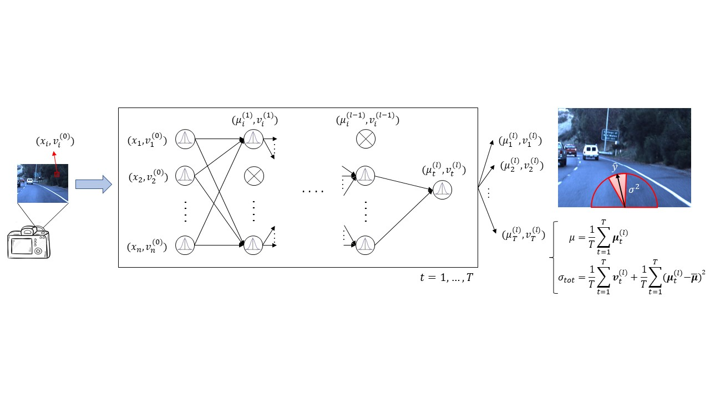

# A General Framework for Uncertainty Estimation in Deep Learning
This repository provides the code used to implement the framework to provide deep learning models with total uncertainty estimates as described in ["A General Framework for Uncertainty Estimation in Deep Learning" (Loquercio, Segù, Scaramuzza. RA-L 2020)](http://rpg.ifi.uzh.ch/docs/RAL20_Loquercio.pdf).
The code used to train and evaluate our framework on CIFAR10 is here provided and ready to use.

If you use this code in academic context, please cite the following publication:
```
@article{loquercio_segu_2020,
  title={A General Framework for Uncertainty Estimation in Deep Learning},
  author={Loquercio, Antonio and Segu, Mattia and Scaramuzza, Davide},
  journal={IEEE Robotics and Automation Letters},
  year={2020},
  publisher={IEEE}
}
```



## Video
CHECK OUT a video demo of our framework [HERE](https://www.youtube.com/watch?v=X7n-bRS5vSM).

## Prerequisites
- torch 1.4.0
- torchvision 0.5.0

## Virtual Environment
If you want, you can run our code inside a Virtual Environment.
To do so, just run the following commands:
```
$ virtualenv venv --python=python3.6
$ source venv/bin/activate
$ pip install -r requirements.txt
```

## Pre-trained Models
You can download pre-trained models with and without dropout at training time [HERE](https://drive.google.com/drive/folders/1gu0nUxzcj2gonon55L0oi6kTjeD6T1v7?usp=sharing).
Move the pre-trained models in the `./checkpoint` folder. If it does not exist yet, create it in the main directory.

## Prerequisites
- torch 1.4.0
- torchvision 0.5.0

## Data
The framework is trained on the CIFAR-10 dataset, automatically downloaded when calling `torchvision.datasets.CIFAR10(...)` with `download=True`.

## Training
You can start a training with

```$ python train.py --model_name resnet18```
 
or you can resume the training with 

```$ python train.py -r --model_name resnet18```


## Evaluation
Evaluate with 

```
$ python eval.py -r -b \
    --load_model_name ${model_to_load} \
    --test_model_name ${model_to_test} \
    --p ${p} \
    --min_variance ${min_variance} \
    --noise_variance ${noise_variance} \
    --num_samples ${num_samples}
```

 You can choose which model to test with the flag `--test_model_name` and which checkpoint to load with the flag `--load_model_name`. For example, you can load the trained weights from `resnet18` and test them with `resnet18_dropout_adf` using the flags

`--load_model_name resnet18_dropout --test_model_name resnet18_dropout_adf`

If you want to test the model that was already trained with dropout layers, use  

`--load_model_name resnet18_dropout --test_model_name resnet18_dropout_adf`

If you want to use Monte-Carlo dropout at test time, add the flag `-m`.
If you want to use the adf model, select a `test_model_name` ending with `adf`.
If you want to test our complete method, combine both, e.g.

```
$ python eval.py -r -b -m \
    --load_model_name resnet18 \
    --test_model_name resnet18_dropout_adf \
    --p 0.02 \
    --min_variance 1e-3 \
    --noise_variance 1e-3 \
    --num_samples 20
```

## Acknowledgments
The implementation of the ADF distribution propagation is partially derived from the paper ["Lightweight Probabilistic Deep Networks" (Gast et al., CVPR 2018)](https://arxiv.org/abs/1805.11327). We thank the authors for providing us their code.
